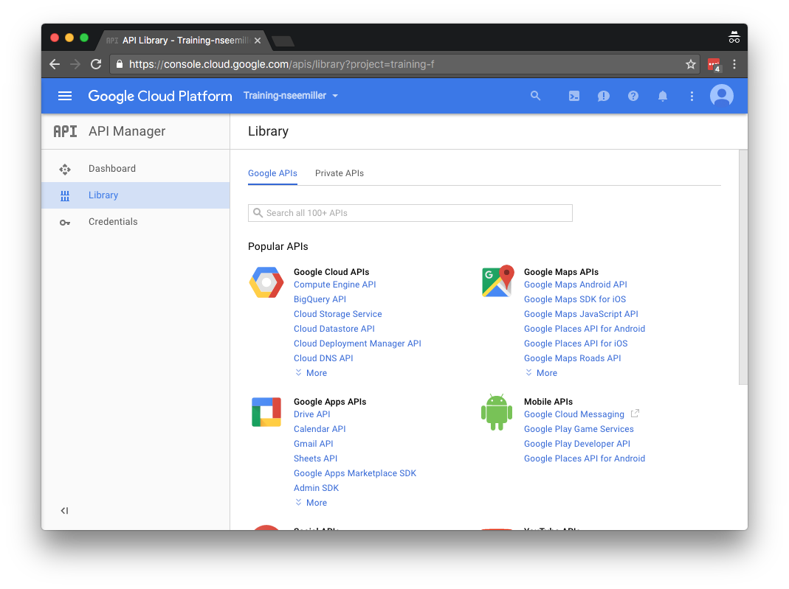
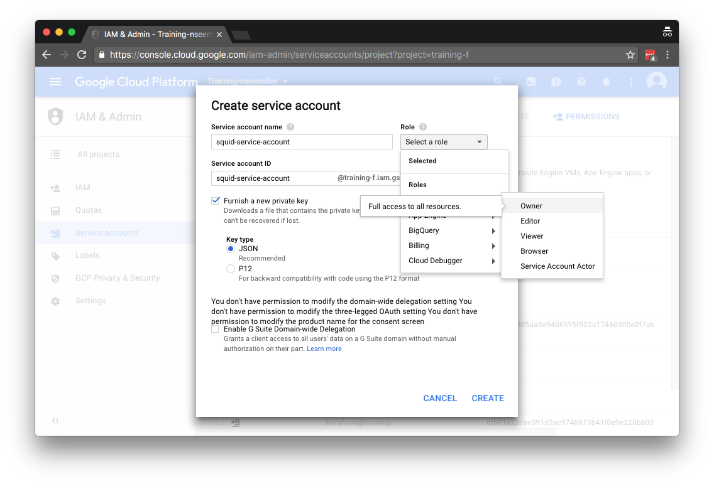
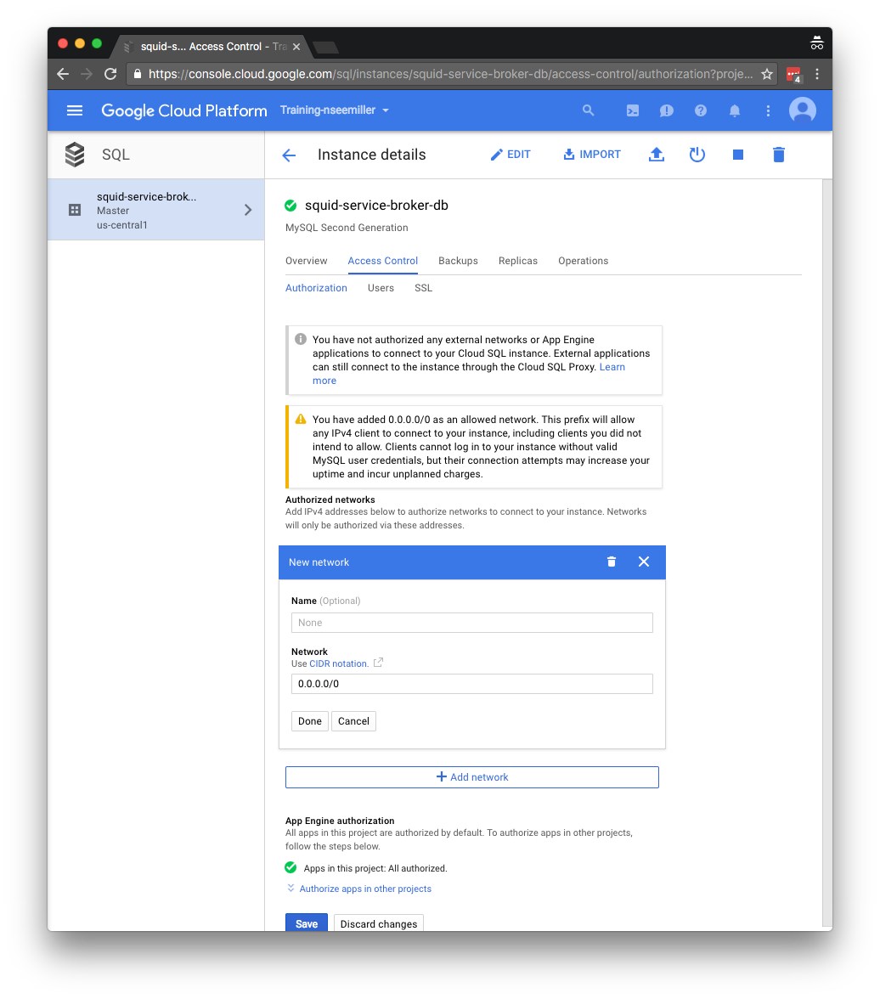
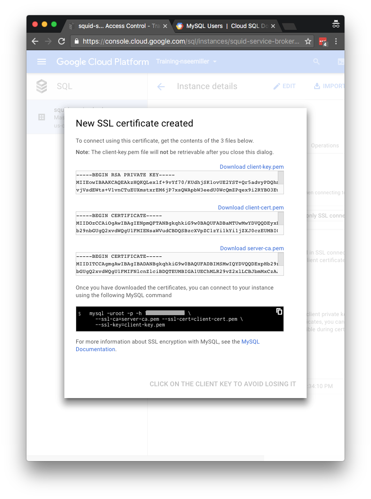

# Deploying a Rails App to Pivotal CloudFoundry on GCP from the Ground Up

At a high level, you will be deploying:
- BOSH Director
- Pivotal CloudFoundry
- Service Broker
- Rails application

### Create a GCP Project and Other Prerequisites

From your [Google Cloud Console](https://console.cloud.google.com/home/dashboard), create a new project. You can find a link to this in the project dropdown menu in the main navigation bar.

Some prerequisites to completing this exercise are to enable a number of GCP APIs. Once your project is created, enable the following API services under the API Manager. You can find the API Manager by clicking on the hamburger menu in the Google Cloud Console.
- Google Cloud Resource Manager API
- Google Identity and Access Management (IAM) API
- Google Cloud SQL API



The second prerequisite task is to create a Service Account. This can be done in the `IAM & Admin` section. Use the hamburger menu to navigate to IAM & Admin. Choose `Service accounts` in the left nav bar, then click `Create Serivce Account` in the top nav bar. When creating the user, set the role to `Owner` and save the private key as a JSON type.


### Deploy a BOSH Director

Follow the instructions to [deploy BOSH on GCP](https://github.com/cloudfoundry-incubator/bosh-google-cpi-release/blob/master/docs/bosh/README.md). It will take about an hour to complete this deployment.

### Deploy Pivotal CloudFoundry

Follow the instructions to [deploy Cloud Foundry on GCE](https://github.com/cloudfoundry-incubator/bosh-google-cpi-release/blob/master/docs/cloudfoundry/README.md). It will take about 1 to 2 hours to complete this deployment.

### CloudFoundry login and setup
You can get the IP address of your CF instance from the Google Cloud Console. Use the hamburger menu to navigate to Compute/Networking. Select `External IP addresses` from the left nav menu. The entry named `cf` will have the IP that you need. Export that to an environment variable and login.

Default login admin/c1oudc0w
```sh
export CF_IP=192.168.1.1
cf login -a https://api.${CF_IP}.xip.io --skip-ssl-validation
```

#### Create a space for the new application
cf create-space squid
cf target -o system -s squid

#### Create the Database for the Service Broker

Go to the Google Cloud Console and use the hamburger menu to navigate to Storage/SQL. Create a new instance. it doesn't matter what generation. It will take a few minutes to create the instance. Once that is done,

Get the IP address of the service broker database from the GCP Console and set it as an environment variable.
```sh
export SB_DB_IP=10.11.12.13
```

Under the `Access Control` section, add a network to allow connectivity from. You can add your specific IP address, or allow the entire Internet by using 0.0.0.0/0. Note that allowing the entire Internet is not a safe practice.


Under the `Users` section, reset the root password to one of your choosing.

Finally, create SSL certificates to allow for a secure connection to the database. You can do this under the `SSL` section. Be sure to download all the files - the server-ca.pem, client-cert.pem and client-key.pem.


Login to the service broker database server using the command that was provided after you created the SSL certificates.
```sh
mysql -uroot -p -h ${SB_DB_IP} --ssl-ca=server-ca.pem --ssl-cert=client-cert.pem --ssl-key=client-key.pem
```

Create the database and a user.
```sql
CREATE DATABASE servicebroker;
CREATE USER '<sb_db_username>'@'%' IDENTIFIED BY '<sb_db_password>';
GRANT ALL PRIVILEGES ON servicebroker.* TO '<sb_db_username>'@'%' WITH GRANT OPTION;
```

#### CloudFoundry Configuration for the Service Broker
Get the IP address of the service broker from the GCP Console and set it as an environment variable.
```sh
export SB_IP=10.11.12.14
```

Create the service broker in CloudFoundry
```sh
cf create-service-broker squid-service squid_security_name squid_security_password https://gcp-service-broker.${SB_IP}.xip.io
```

cf enable-service-access google-cloudsql

cf marketplace

#### Deploy a Service Broker

Clone the repository for the service broker
```sh
git clone git@github.com:GoogleCloudPlatform/gcp-service-broker.git
```

I used the `develop` branch so that I would have the latest changes.
```sh
cd gcp-service-broker/
git co develop
```

Update the manifest file to include the required environment variables from the README of the GCP Service Broker repository.
- ROOT_SERVICE_ACCOUNT_JSON: the string version of the credentials file created for the Owner level Service Account
- SECURITY_USER_NAME :a username to sign all service broker requests with - the same one used in cf create-service-broker
- SECURITY_USER_PASSWORD: a password to sign all service broker requests with - the same one used in cf create-service-broker
- DB_HOST: the host for the database to back the service broker
- DB_USERNAME: the database username for the service broker to use
- DB_PASSWORD: the database password for the service broker to use
- CA_CERT:
- CLIENT_CERT:
- CLIENT_KEY:
- CLOUDSQL_CUSTOM_PLANS: A map of plan names to string maps with fields guid, name, description, tier, pricing_plan, max_disk_size, display_name, and service (Cloud SQL's service id) - if unset, the service will be disabled. e.g.

Push the service broker.
```sh
cf push -f manifest.yml
```

### YMMV - You may need to update the Go and Ruby build packs.
You can check what build packs are being used by running the following command. Compare those versions to the latest at the [CloudFoundry Go Buildpack releases](https://github.com/cloudfoundry/go-buildpack/releases) and [CloudFoundry Ruby Buildpack releases](https://github.com/cloudfoundry/ruby-buildpack/releases) pages.
```sh
cf buildpacks
```

If necessary, download and update your CloudFoundry instance with new build packs.
```sh
cf update-buildpack go_buildpack -p ~/Downloads/go_buildpack-cached-v1.7.15.zip
cf update-buildpack ruby_buildpack -p ~/Downloads/ruby_buildpack-cached-v1.6.28.zip
```

#### Create the DB service for the app
cf create-service google-cloudsql test_plan squid_db_service -c '{"instance_name": "squid-app-db", "database_name": "squid-app"}'
cf services


#### Create a Rails application

Use an existing app or create a new one.
```sh
rails new squid --database=mysql
cd squid
rails generate scaffold tentacle name:string
```

Create a manifest file with the following content. Note the magic database connection URL!
```sh
vi manifest.yml
```
```yml
applications:
  - name: squid
    label: 'squid app'
    description: one squid, 2 squid, 3 squid

  - name: dbcreator
    buildpack: ruby_buildpack
    command: bundle exec rake db:create
    health-check-type: none
    instances: 1
    no-route: true

  - name: migrator
    buildpack: ruby_buildpack
    command: bundle exec rake db:migrate
    health-check-type: none
    instances: 1
    no-route: true

env:
  DATABASE_URL: mysql2://<USER_ID>:<PASSWORD>@<DB IP ADDRESS>/<DB NAME>?reconnect=true&wait_timeout=36000&sslkey=client-key.pem&sslcert=client-cert.pem&sslca=ca-cert.pem
```

Copy the Database SSL certificates into the root of the Rails app.

#### Bind the service to the app
```sh
cf bind-service squid squid_db_service
```

#### Push the apps to create and migrate the database and the app itself
```sh
cf push dbcreator
cf push migrator
cf push squid
```

## Helpful Links

Here is a collection of pages used in the development of this document
- https://docs.pivotal.io/pivotalcf/1-8/customizing/gcp.html
- https://github.com/cloudfoundry-incubator/bosh-google-cpi-release/blob/master/docs/bosh/README.md
- https://github.com/cloudfoundry-incubator/bosh-google-cpi-release/blob/master/docs/cloudfoundry/README.md
- https://github.com/GoogleCloudPlatform/gcp-service-broker
